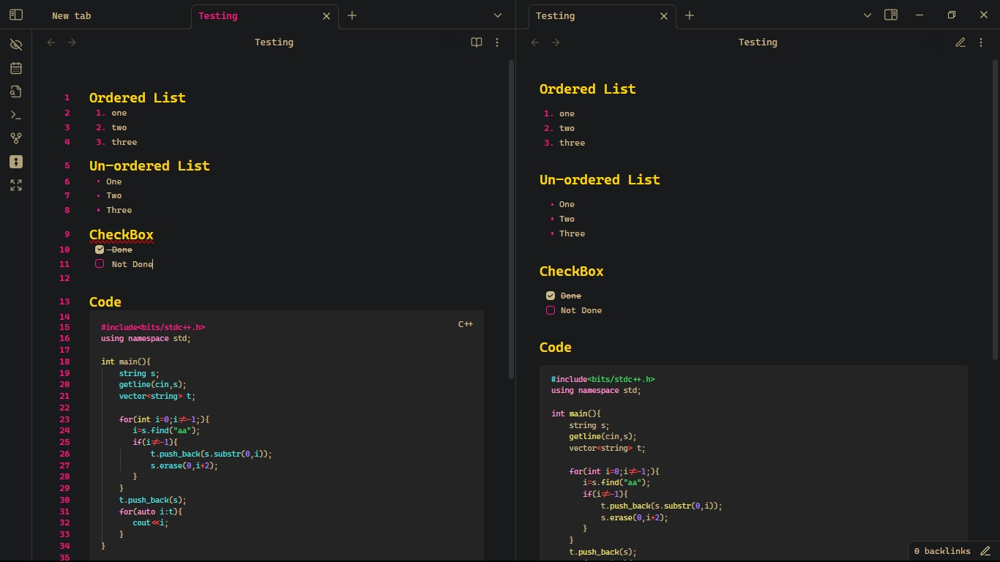

# Minimal-Dark-Coder Theme @Krishna
Minimal Dark Coder Theme theme for [Obsidian](https://obsidian.md/), compatible with Obsidian v1.8.9.

## Install
1. Download obsidian.css to your Obsidian vault folder.
2. In Obsidian, click Settings->Plugins and turn on "Custom CSS".
3. There is no step 3! Enjoy!

## License
I don't really care what happens to this theme, so I put it under [The Unlicense](./LICENSE) and set it free!
